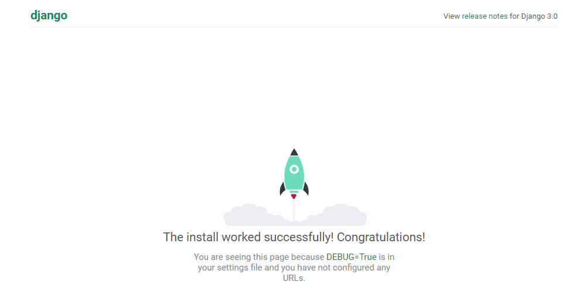
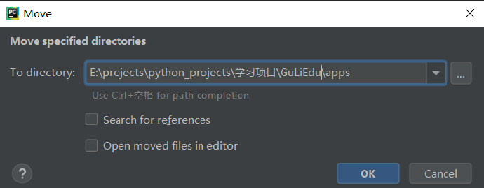

### Django-xadmin项目搭建网站学习笔记

#### 引言

这个项目根据B站上的视频学习后的笔记，视频来源：<https://www.bilibili.com/video/av35100907> 

这个项目主要是通过django-xadmin搭建一个在线教育平台的后台网站。在这个平台中，可以展示教育机构列表、讲师列表、课程列表等，用户可以注册并选择课程学习、评价等。具体的业务流可以参考B站视频的讲解，很详细，这里仅仅记录技术上的实现步骤和方法。

最终的结果是要建立十五张数据表

+ 用户：
  + 用户信息表
  + 邮箱验证码表
  + 轮播图信息表
+ 课程：
  + 课程信息表
  + 章节信息表
  + 视频信息表
  + 资源信息表
+ 机构：
  + 机构信息表
  + 城市信息表
  + 讲师信息表
+ 操作：
  + 用户咨询表
  + 用户收藏表
  + 用户课程表
  + 用户消息表
  + 用户评论表

#### 一、先搭建Django项目框架

##### 1、创建Django项目

首先需要安装django库。（最新版本是diango3，但是大部分教程都是根据django2来写的，并且xadmin对django2很友好，所以用django2来写）

```python3
pip install django=2
```

完成之后，进入你要创建的项目路径，在命令框中输入命令创建django项目

```
django-admin startproject GuLiEdu
```

创建成功之后，查看项目路径如下：

+ GuLiEdu
  + GuLiEdu
    + \_\_init\_\_.py
    + asgi.py
    + settings.py
    + urls.py
    + wsgi.py
  + manage.py

然后用pycharm打开项目就可以开始编辑了。

如果使用的事专业版的pycharm，可以直接选择新建项目，选择创建django项目，就可以跳过上面的两个步骤。

在Terminal运行项目

```
python manage.py runserver
```

启动后访问 127.0.0.8000，出现下面界面说明成功创建了django项目。



 

##### 2、配置django项目参数

在settings.py中修改数据库配置：

```
DATABASES = {
    'default': {
        'ENGINE': 'django.db.backends.mysql', 
        'NAME': 'guliedu', # 你要建立的数据库名称
        'USER': 'root',
        'PASSWORD': '123456',
        'HOST': 'localhost',
        'PORT': '3306',
    }
}
```

由于在settings.py里面设置了数据库名称，但是实际上并没有，所以需要自己打开Navicat创建一个名为guliedu的数据库。

修改时区信息等：

```
LANGUAGE_CODE = 'zh-hans'
TIME_ZONE = 'Asia/Shanghai'
USE_I18N = True
USE_L10N = True
USE_TZ = False
```

配置静态文件和媒体文件：

```
# 配置静态资源文件路径
STATIC_URL = '/static/'
STATICFILES_DIRS=[
    os.path.join(BASE_DIR, 'static')
]
# 配置媒体文件路径
MEDIA_URL = '/static/media/'
MEDIA_ROOT = os.path.join(BASE_DIR, 'static/media')
```

同时还要在处理器上加一行代码：

```
'context_processors': [
                'django.template.context_processors.debug',
                'django.template.context_processors.request',
                'django.contrib.auth.context_processors.auth',
                'django.contrib.messages.context_processors.messages',
                'django.template.context_processors.media', # 加上这一行
            ],
```

这些操作基本上都是每个django项目都要有的操作，养成习惯直接改就行了。

#### 二、搭建各个子app

##### 1、创建app

根据引言中的业务流分析可以知道，需要四个app，分别是users，courses，orgs，operations。

所以开始建立第一个app

```
python manage.py startapp users
```

视频中没报错，但是在我的电脑中报错了，提示信息是：

```
django.core.exceptions.ImproperlyConfigured: Error loading MySQLdb module.
Did you install mysqlclient?
```

根据提示信息，下载安装mysqlclient后，再创建这四个app就没有报错。

```
pip install mysqlclient
python manage.py startapp users
python manage.py startapp courses
python manage.py startapp orgs
python manage.py startapp operations
```

项目的根目录下多个四个文件夹，分别是上面的几个名称，这说明创建成功。但是还需要在settings.py中，将这几个app注册一下。

```
INSTALLED_APPS = [
    'django.contrib.admin',
    'django.contrib.auth',
    'django.contrib.contenttypes',
    'django.contrib.sessions',
    'django.contrib.messages',
    'django.contrib.staticfiles',
    'users',
    'courses',
    'orgs',
    'operations'
]
```

然后还需要在项目的urls.py中更改一下路由。

```
from django.contrib import admin
from django.urls import path, include, re_path

urlpatterns = [
    path('admin/', admin.site.urls),
    re_path(r'^users/', include(('users.urls', 'users'), namespace='users')),
    re_path(r'^courses/', include(('courses.urls', 'courses'), namespace='courses')),
    re_path(r'^orgs/', include(('orgs.urls', 'orgs'), namespace='orgs')),
    re_path(r'^operations/', include(('operations.urls', 'operations'), namespace='operations'))
]
```

在这里因为版本问题跟视频内容有点不同，视频内容：

```
from django.contrib import admin
from django.conf.urls import url,include

urlpatterns = [
    url('admin/', admin.site.urls),
    url(r'^users/', include(('users.urls', 'users'), namespace='users'))
]
```

区别在于哪里呢？版本问题，查了资料发现，**url()这种方式将不再推荐，建议使用path()或re_path()方式。其中re_path()是可以接带有正则表达式的请求，path()则只能接普通的请求。**

由于路由进行了分发，所以每个app里也需要创建一份urls.py。目前还不知道各个app里面具体怎么分发路由，所以app里的urls.py内容就只有一个空列表。j具体内容以后再写，先搭建起框架来。

```
from django.contrib import admin
from django.urls import path, include, re_path

urlpatterns = [

]
```

##### 2、app项目整理技巧

现在出现了一个情况，就是app项目和我们的根项目是在同一级，如果app项目多了，会有点混乱，所以引入一个apps文件夹来管理所有app项目。

首先，在根目录创建一个apps文件夹。

接下来把我们的app项目移动到apps文件夹中。但是复制的时候需要注意：两个勾选框不要勾选。如果勾选了，它里面的路径查找都是按照以前的方式进行的。



接下来把apps文件夹标记成sources root。标记完成之后会变成蓝色的。


最后需要在settings.py中把apps放到python的路径当中。

```
import sys
sys.path.insert(0, os.path.join(BASE_DIR, 'apps'))
```

##### 3、设计models

表的创建都是在models中完成的，每一个类对应一个表，根据业务流分析得出各个字段。

users项目中的models.py：

这些具体看代码是能看懂的。

```
from django.db import models
from django.contrib.auth.models import AbstractUser
from datetime import datetime

# Create your models here.
# 一般来讲都是继承models就行
# 但是django提供了user类型，我们可以借用
# 用户表
class UserProfile(AbstractUser):
    # null=True 表示在数据库里面 这些字段是可以为空的
    # blank=True 表示在页面表单里 这些字段是可以为空的
    image = models.ImageField(upload_to='user/', max_length=200, verbose_name='用户头像',null=True, blank=True)
    nick_name = models.CharField(max_length=20, verbose_name='用户昵称', null=True, blank=True)
    birthday = models.DateTimeField(verbose_name='用户生日', null=True, blank=True)
    gender = models.CharField(choices=(('girl','女'), ('boy', '男')), max_length=10, verbose_name='性别', default='girl')
    address = models.CharField(max_length=200, verbose_name='用户住址', null=True, blank=True)
    phone = models.CharField(max_length=11, verbose_name='用户手机', null=True, blank=True)
    add_time = models.DateTimeField(default=datetime.now, verbose_name='添加时间')

    def __str__(self):
        return self.username

    class Meta:
        verbose_name = '用户信息'
        verbose_name_plural = verbose_name

# 轮播图
class BannerInfo(models.Model):
    image = models.ImageField(upload_to='banner/', verbose_name='轮播图片', max_length=200)
    url = models.URLField(default='http://www.atguigu.com', max_length=200, verbose_name='图片链接')
    add_time = models.DateTimeField(default=datetime.now, verbose_name='添加时间')

    def __str__(self):
        return self.image

    class Meta:
        verbose_name = '轮播图信息'
        verbose_name_plural = verbose_name

# 验证码
class EmailVerifyCode(models.Model):
    code = models.CharField(max_length=20, verbose_name='邮箱验证码')
    email = models.EmailField(max_length=200, verbose_name='验证码邮箱')
    send_type = models.IntegerField(choices=((1, 'register'), (2, 'forget'), (3, 'change')), verbose_name='验证码类型')
    add_time = models.DateTimeField(default=datetime.now, verbose_name='添加时间')

    def __str__(self):
        return self.code

    class Meta:
        verbose_name = '邮箱验证码'
        verbose_name_plural = verbose_name

```

由于Django内置了user类，但是你不想直接用，而是创建了新的UserProfile类，所以需要在settings.py中做一下配置：

```
AUTH_USER_MODEL = 'users.UserProfile'
```

courses项目中的models.py：

```
from django.db import models
from datetime import datetime
from orgs.models import OrgInfo, TeacherInfo

# 课程表
class CourseInfo(models.Model):
    image = models.ImageField(upload_to='course/', max_length=200, verbose_name='课程封面')
    name = models.CharField(max_length=20, verbose_name='课程名称')
    study_time = models.IntegerField(default=0, verbose_name='学习时长')
    study_num = models.IntegerField(default=0, verbose_name='学习人数')
    level = models.CharField(choices=(('gj', '高级'), ('zj', '中级'), ('cj', '初级')), max_length=5, verbose_name='课程难度', default='cj')
    love_num = models.IntegerField(default=0, verbose_name='收藏数')
    click_num = models.IntegerField(default=0, verbose_name='访问量')
    desc = models.CharField(max_length=200, verbose_name='课程简介')
    detail = models.TextField(verbose_name='课程详情')
    category = models.CharField(choices=(('qd','前端开发'), ('hd', '后端开发')), verbose_name='课程类别', max_length=5)
    course_notice = models.CharField(max_length=200, verbose_name='课程公告')
    course_need = models.CharField(max_length=100, verbose_name='课程须知')
    teacher_tell = models.CharField(max_length=100, verbose_name='老师教导')
    orginfo = models.ForeignKey(OrgInfo, verbose_name='所属机构',on_delete=models.CASCADE)
    teacherinfo = models.ForeignKey(TeacherInfo, verbose_name='所属老师', on_delete=models.CASCADE)
    add_time = models.DateTimeField(default=datetime.now, verbose_name='添加时间')
    # TODO 用户与课程关系
    # TODO 课程与资料关系

    def __str__(self):
        return self.name

    class Meta:
        verbose_name = '课程信息'
        verbose_name_plural = verbose_name

# 章节表
class LessonInfo(models.Model):
    name = models.CharField(max_length=30, verbose_name='章节名称')
    courseinfo = models.ForeignKey(CourseInfo, verbose_name='所属课程', on_delete=models.CASCADE)
    add_time = models.DateTimeField(default=datetime.now, verbose_name='添加时间')

    def __str__(self):
        return self.name

    class Meta:
        verbose_name = '章节信息'
        verbose_name_plural = verbose_name

# 视频信息
class VideoInfo(models.Model):
    name = models.CharField(max_length=30, verbose_name='视频名称')
    study_time = models.IntegerField(default=0, verbose_name='视频时长')
    url = models.URLField(default='http://www.atguigu.com', verbose_name='视频链接', max_length=200)
    lessoninfo = models.ForeignKey(LessonInfo, verbose_name='所属章节', on_delete=models.CASCADE)
    add_time = models.DateTimeField(default=datetime.now, verbose_name='添加时间')

    def __str__(self):
        return self.name

    class Meta:
        verbose_name = '视频信息'
        verbose_name_plural = verbose_name


# 资源表
class SourceInfo(models.Model):
    name = models.CharField(max_length=50, verbose_name='资源名称')
    download = models.FileField(upload_to='source/', verbose_name='下载路径', max_length=200)
    courseinfo = models.ForeignKey(CourseInfo, verbose_name='所属课程', on_delete=models.CASCADE)
    add_time = models.DateTimeField(default=datetime.now, verbose_name='添加时间')

    def __str__(self):
        return self.name

    class Meta:
        verbose_name = '资源信息'
        verbose_name_plural = verbose_name
```

orgs项目中的models.py：

```
from django.db import models
from datetime import datetime

# 城市信息
class CityInfo(models.Model):
    name = models.CharField(max_length=20, verbose_name='城市名称')
    add_time = models.DateTimeField(default=datetime.now, verbose_name='添加时间')

    def __str__(self):
        return self.name

    class Meta:
        verbose_name = '城市信息'
        verbose_name_plural = verbose_name


# 机构信息
class OrgInfo(models.Model):
    image = models.ImageField(upload_to='org/', max_length=200, verbose_name='机构封面')
    name = models.CharField(max_length=200, verbose_name='机构名称')
    course_num = models.IntegerField(default=0, verbose_name='课程数')
    study_num = models.IntegerField(default=0, verbose_name='学习人数')
    address = models.CharField(max_length=200, verbose_name='机构地址')
    desc = models.CharField(max_length=200, verbose_name='机构简介')
    detail = models.TextField(verbose_name='机构详情')
    love_num = models.IntegerField(default=0, verbose_name='收藏数')
    click_num = models.IntegerField(default=0, verbose_name='访问量')
    category = models.CharField(choices=(('pxjg', '培训机构'), ('gx', '高校'), ('gr', '个人')), max_length=10, verbose_name='机构类别')
    cityinfo = models.ForeignKey(CityInfo, verbose_name='所在城市', on_delete=models.CASCADE)
    add_time = models.DateTimeField(default=datetime.now, verbose_name='添加时间')

    def __str__(self):
        return self.name

    class Meta:
        verbose_name = '机构信息'
        verbose_name_plural = verbose_name

# 教师表
class TeacherInfo(models.Model):
    image = models.ImageField(upload_to='teacher/', max_length=200, verbose_name='讲师头像')
    name = models.CharField(max_length=20, verbose_name='讲师姓名')
    work_year = models.IntegerField(default=0, verbose_name='工作年限')
    work_position = models.CharField(max_length=20, verbose_name='工作职位')
    work_style = models.CharField(max_length=200, verbose_name='教学特点')
    work_company = models.ForeignKey(OrgInfo, verbose_name='所述机构', on_delete=models.CASCADE)
    age = models.IntegerField(default=30, verbose_name='讲师年龄')
    gender = models.CharField(choices=(('girl', '女'), ('boy', '男')), max_length=10, verbose_name='讲师性别', default='boy')
    love_num = models.IntegerField(default=0, verbose_name='收藏数')
    click_num = models.IntegerField(default=0, verbose_name='访问量')
    add_time = models.DateTimeField(default=datetime.now, verbose_name='添加时间')
    # TODO 老师和课程的关系


    def __str__(self):
        return self.name

    class Meta:
        verbose_name = '讲师信息'
        verbose_name_plural = verbose_name
```

operations项目中的models.py：

```
from django.db import models
from datetime import datetime
from users.models import UserProfile
from courses.models import CourseInfo

# 用户咨询表
class UserAsk(models.Model):
    name = models.CharField(max_length=30, verbose_name='姓名')
    phone = models.CharField(max_length=11, verbose_name='手机')
    course = models.CharField(max_length=20, verbose_name='课程')
    add_time = models.DateTimeField(default=datetime.now, verbose_name='咨询时间')

    def __str__(self):
        return self.name

    class Meta:
        verbose_name = '咨询信息'
        verbose_name_plural = verbose_name


# 用户收藏表
class UserLove(models.Model):
    love_man = models.ForeignKey(UserProfile, verbose_name='收藏用户', on_delete=models.CASCADE)
    love_id = models.IntegerField(verbose_name='收藏id')
    love_type = models.IntegerField(choices=((1, 'org'), (2, 'course'), (3, 'teacher')), verbose_name='收藏类别')
    love_statu = models.BooleanField(default=False, verbose_name='收藏状态')
    add_time = models.DateTimeField(default=datetime.now, verbose_name='收藏时间')

    def __str__(self):
        # TODO 理解
        return self.love_man.username

    class Meta:
        verbose_name = '收藏信息'
        verbose_name_plural = verbose_name

# 用户学习课程表
class UserCourse(models.Model):
    study_man = models.ForeignKey(UserProfile, verbose_name='学习用户', on_delete=models.CASCADE)
    study_course = models.ForeignKey(CourseInfo, verbose_name='学习课程', on_delete=models.CASCADE)
    add_time = models.DateTimeField(default=datetime.now, verbose_name='学习时间')

    def __str__(self):
        return self.study_man.username

    class Meta:
        # 下次学习时候就不会再添加
        unique_together = ('study_man', 'study_course')
        verbose_name = '用户学习课程信息'
        verbose_name_plural = verbose_name


# 用户评论表
class UserComment(models.Model):
    comment_man = models.ForeignKey(UserProfile, verbose_name='评论用户', on_delete=models.CASCADE)
    comment_course = models.ForeignKey(CourseInfo, verbose_name='评论课程', on_delete=models.CASCADE)
    comment_content = models.CharField(max_length=300, verbose_name='评论内容')
    add_time = models.DateTimeField(default=datetime.now, verbose_name='评论时间')

    def __str__(self):
        return self.comment_content

    class Meta:
        verbose_name = '用户评论课程信息'
        verbose_name_plural = verbose_name


# 用户消息表
class UserMessage(models.Model):
    # TODO 解释
    message_man = models.IntegerField(default=0, verbose_name='消息目标用户')
    message_content = models.CharField(max_length=200, verbose_name='消息内容')
    message_status = models.BooleanField(default=False, verbose_name='消息状态')
    add_time = models.DateTimeField(default=datetime.now, verbose_name='评论时间')

    def __str__(self):
        return self.message_content

    class Meta:
        verbose_name = '用户消息信息'
        verbose_name_plural = verbose_name
```

##### 4、数据迁移

数据模型创建好了之后，使用如下命令，创建表

```
python manage.py makemigrations
```

此时碰到提示说要安装Pillow依赖库，安装好了之后，迁移成功。

```
pip install Pillow
python manage.py makemigrations
python manage.py migrate
```

运行完了之后，在数据库中可以看到表创建成功了。

#### 三、安装xadmin

对于xadmin，在pip中install一般找不到这样的库，这是因为我们安装xadmin一般都是直接把它的源码当做extar_app放进去的，这样的话，就可以更灵活地使用插件等功能。

##### 1、安装xadmin

在项目根目录下新建extra_apps目录

下载xadmin源码[https://github.com/sshwsfc/xadmin](https://github.com/sshwsfc/xadmin/tree/django2) 后解析，将其中的xadmin文件夹复制到extra_apps目录中

然后将extra_apps变成sources root，同理需要在settings.py中将其添加到python路径中。

```
sys.path.insert(0,os.path.join(BASE_DIR,'extra_apps'))
```

##### 2、配置参数

由于我们是把xadmin当做额外的app模块放入项目中的，所以需要在settings.py中进行注册。

```
INSTALLED_APPS = [
    'django.contrib.admin',
    'django.contrib.auth',
    'django.contrib.contenttypes',
    'django.contrib.sessions',
    'django.contrib.messages',
    'django.contrib.staticfiles',
    'courses',
    'users',
    'orgs',
    'operations',
    'xadmin' # 新添加
]
```

另外，xadmin有自己的一套UI，它的链接也不一样，所以要在urls.py中修改路由，指向xadmin

```
urlpatterns = [
    # path('admin/', admin.site.urls),
    path('xadmin/',xadmin.site.urls),
    re_path(r'^users/', include(('users.urls', 'users'), namespace='users')),
    re_path(r'^courses/', include(('courses.urls', 'courses'), namespace='courses')),
    re_path(r'^orgs/', include(('orgs.urls', 'orgs'), namespace='orgs')),
    re_path(r'^operations/', include(('operations.urls', 'operations'), namespace='operations'))
]
```

这个时候xadmin其实已经安装好了，但是运行的时候会报错，因为一些依赖库还没有安装。所以需要先进行安装

```
django-crispy-forms
django-import-export
django-reversion
django-formtools
future
httplib2
six
```


